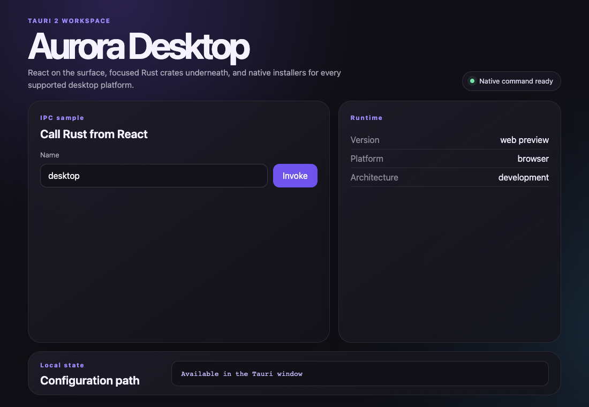

# create-tauri-workspace

[](https://github.com/erchoc/create-tauri-workspace/actions/workflows/ci.yml)
[](https://www.npmjs.com/package/create-tauri-workspace)
[](./LICENSE)
[](./packages/create-tauri-workspace/package.json)

An opinionated Tauri 2 workspace generator for desktop apps built with Bun,
React, Vite, TypeScript, and Rust. Repository guidance for Codex and Claude Code
is included by default.



## Why this generator?

The official Tauri scaffolder is excellent when you want to choose every part
of the stack. `create-tauri-workspace` is for teams that want a consistent
starting point with the project boundaries and release plumbing already in
place.

- Zero runtime dependencies in the generator.
- A small two-crate Rust workspace instead of one large application crate.
- Frontend and native code in separate workspaces.
- Responsive starter UI with a typed React-to-Rust command example.
- Desktop icons, resources, NSIS hooks, and portable Windows packaging.
- Cross-platform checks and draft GitHub Releases.
- One concise `AGENTS.md`, imported by `CLAUDE.md`, for consistent AI context.
- No Node.js or Bun runtime shipped in the final application.

## Quick start

```bash
npx create-tauri-workspace my-desktop-app
cd my-desktop-app
bun run dev
```

Using Bun directly works too:

```bash
bunx create-tauri-workspace my-desktop-app
```

The application name is the only input. The generator derives the directory,
display name, npm workspace names, Rust crate name, and placeholder Tauri
identifier.

## Generated workspace

```text
my-desktop-app/
├── AGENTS.md            Shared repository guidance for coding agents
├── CLAUDE.md            Imports AGENTS.md for Claude Code
├── apps/
│   └── desktop/          React 19, Vite, and TypeScript
├── crates/
│   ├── app/              Tauri shell, capabilities, and IPC commands
│   └── core/             Models and framework-independent native logic
├── resources/            Desktop icons, defaults, and notices
├── installers/           NSIS hooks and platform packaging notes
├── scripts/              Native builds and Windows portable packaging
├── docs/                 Architecture, development, and distribution
└── .github/workflows/    Cross-platform CI and draft releases
```

The generated project intentionally starts small. Add a new crate only when a
real dependency or ownership boundary appears.

## Included commands

| Command | Purpose |
| --- | --- |
| `bun run dev` | Start Vite and the Tauri desktop window |
| `bun run frontend:dev` | Run the frontend in a browser |
| `bun run check` | Type-check, check Rust, run Clippy, and verify formatting |
| `bun run build` | Build bundles for the current platform |
| `bun run release:check` | Catch placeholder release metadata |

## CLI options

```text
create-tauri-workspace [project-name] [options]

Options:
  --output <directory>  Parent directory for the new project
  --no-install          Do not run bun install
  --no-git              Do not initialize a Git repository
  -h, --help            Show help
  -v, --version         Show version
```

If Bun is not installed, project generation still succeeds and prints the
remaining setup commands.

## Requirements

- [Bun](https://bun.sh/) 1.3 or newer
- [Rust](https://www.rust-lang.org/tools/install) stable
- [Tauri platform prerequisites](https://v2.tauri.app/start/prerequisites/)

## Develop the generator

```bash
git clone https://github.com/erchoc/create-tauri-workspace.git
cd create-tauri-workspace
bun install
bun run check
```

Test the unpublished CLI:

```bash
node packages/create-tauri-workspace/bin/create-tauri-workspace.mjs demo-app \
  --output ./work \
  --no-install \
  --no-git
```

See [CONTRIBUTING.md](./CONTRIBUTING.md) for contribution guidelines and
[PUBLISHING.md](./PUBLISHING.md) for the release process.

## License

MIT
