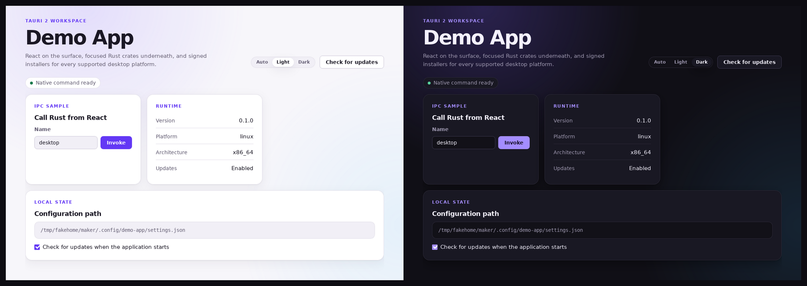

# create-tauri-workspace

[](https://github.com/erchoc/create-tauri-workspace/actions/workflows/ci.yml)
[](https://www.npmjs.com/package/create-tauri-workspace)
[](./LICENSE)
[](./packages/create-tauri-workspace/package.json)

English · [简体中文](./README.zh-CN.md)

Scaffold a macOS and Windows desktop app with signed automatic updates, a
design token system, and release workflows already wired together.



## Quick start

```bash
npx create-tauri-workspace my-app --identifier dev.you.myapp --repo you/my-app
cd my-app
bun run dev
```

Only the name is required. Run `npx create-tauri-workspace doctor` first to
check this machine.

## What you get

- **Signed automatic updates**, off until `bun run updater:init` creates a key.
  Without one the updater is never registered, so the app cannot offer an
  install it cannot verify.
- **Design tokens** with light and dark themes and a theme control in the
  window. Colours, spacing and radii live in one file.
- **Two Rust crates with a real boundary.** `crates/core` is testable and never
  depends on Tauri; `crates/app` adapts it to the desktop shell.
- **Desktop basics**: single-instance launch, restored window position,
  structured logs, persisted settings, an error boundary.
- **Release workflows** that check the tag, the version, and the signing secret
  before any platform builds, then publish a draft release.
- **Agent guidance**: one `AGENTS.md`, plus a skill Claude Code and Codex share.

## Install the skill

Both tools read the same `SKILL.md`, from different directories:

```bash
npx create-tauri-workspace skill install            # this project
npx create-tauri-workspace skill install --global   # every project
```

| Tool | Installed to |
| --- | --- |
| Claude Code | `.claude/skills/desktop-app/` |
| Codex | `.agents/skills/desktop-app/` |

Claude Code can also install it as a plugin:

```text
/plugin marketplace add erchoc/create-tauri-workspace
/plugin install desktop-app@create-tauri-workspace
```

## CLI

```text
create-tauri-workspace [project-name] [options]
create-tauri-workspace skill install [options]
create-tauri-workspace doctor

  --output <directory>  Parent directory for the new project
  --identifier <id>     Bundle identifier, such as com.example.app
  --repo <owner/name>   GitHub repository used for update downloads
  --no-install          Do not run bun install
  --no-git              Do not initialize a Git repository
```

## Requirements

| Tool | Minimum | Why |
| --- | --- | --- |
| [Bun](https://bun.sh/) | 1.4 | Runs every project command |
| [Node.js](https://nodejs.org/) | 24 | Runs the release and updater scripts |
| [Rust](https://rustup.rs/) | 1.98 | Compiles the application |

Plus the [Tauri platform prerequisites](https://v2.tauri.app/start/prerequisites/).
`bun run doctor` inside a generated project reports what is missing and how to
fix it.

These versions bind contributors, not users: the app you ship is a native
binary with no JavaScript runtime inside it.

## Repository layout

```text
packages/create-tauri-workspace/
├── bin/                  Executable entry point
├── src/                  CLI modules
├── skills/desktop-app/   The skill, and the Claude Code plugin source
└── templates/default/    The application that gets generated
site/                     Documentation page, published to GitHub Pages
scripts/                  Package verification and release helpers
```

## Contributing

```bash
bun install
bun run check
```

See [CONTRIBUTING.md](./CONTRIBUTING.md) and [PUBLISHING.md](./PUBLISHING.md).

## License

MIT
